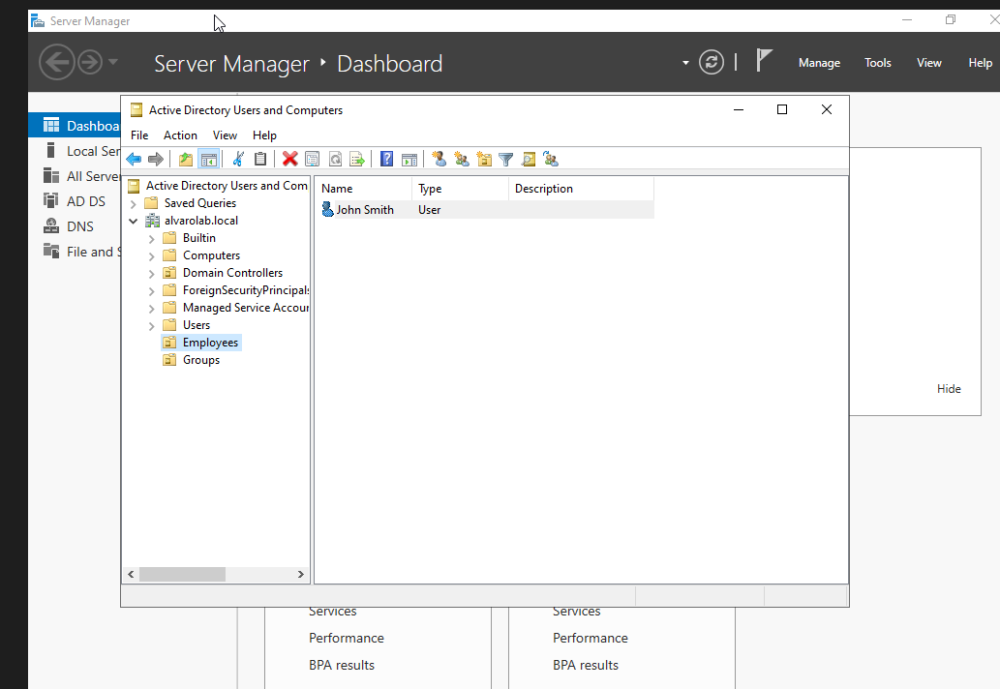
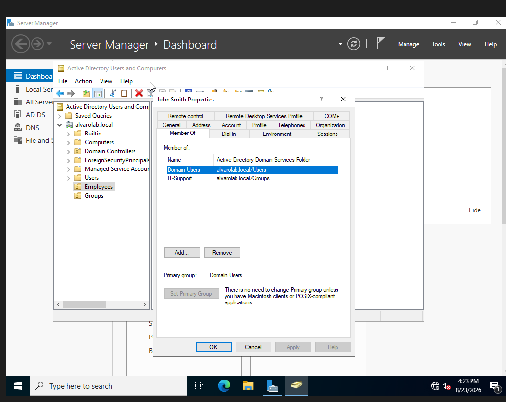
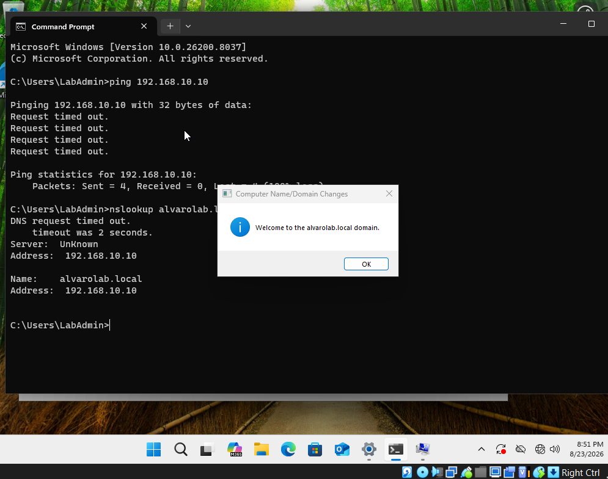
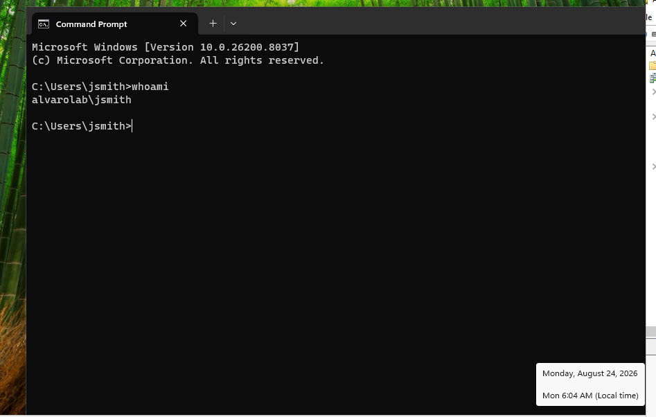
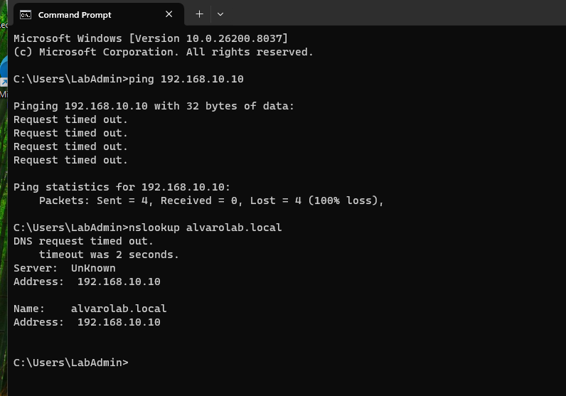

# active-directory-helpdesk-lab
Hands-on Windows Active Directory and IT support lab covering user administration, permissions, networking, and troubleshooting.
## Lab Overview

This project simulates a small business Windows domain environment using Windows Server 2022 and Windows 11 virtual machines in VirtualBox.

The lab was built to practice common IT support and system administration tasks including Active Directory, DNS, user and group management, domain joining, file sharing, permissions, and troubleshooting.

## Lab Environment

- Oracle VirtualBox
- Windows Server 2022
- Windows 11
- Active Directory Domain Services (AD DS)
- DNS
- Domain: alvarolab.local
- Domain Controller: DC01
- Client Computer: CLIENT01

## Skills Practiced

- Installed and configured Active Directory Domain Services
- Promoted Windows Server 2022 to a domain controller
- Configured DNS for an Active Directory environment
- Created organizational units (OUs)
- Created and managed domain user accounts
- Created security groups and assigned users to groups
- Joined a Windows 11 workstation to the domain
- Configured SMB network file sharing
- Configured share and NTFS permissions
- Tested domain-user access to network resources
- Diagnosed DNS problems using ipconfig and nslookup
- Corrected an invalid DNS configuration and verified connectivity

Lab Screenshots

Windows 11 Domain Client
Configured a Windows 11 workstation and successfully joined CLIENT01 to the alvarolab.local Active Directory domain.

Domain Authentication
Successfully authenticated to CLIENT01 using the domain account alvarolab\jsmith.

DNS Configuration and Troubleshooting
Configured CLIENT01 to use the domain controller as its DNS server and diagnosed an incorrect DNS configuration using ipconfig and nslookup.

