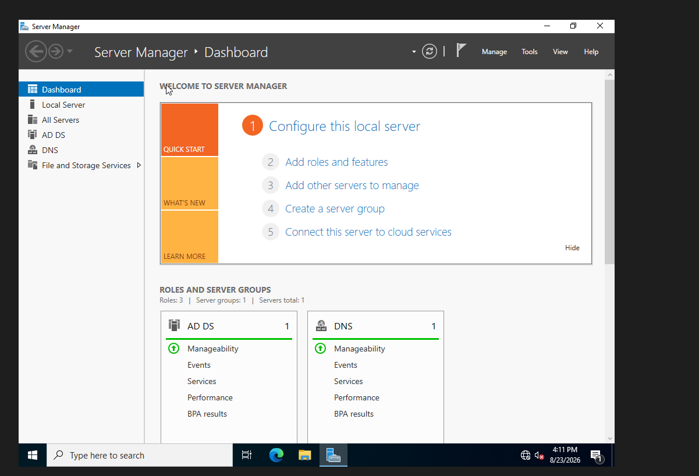
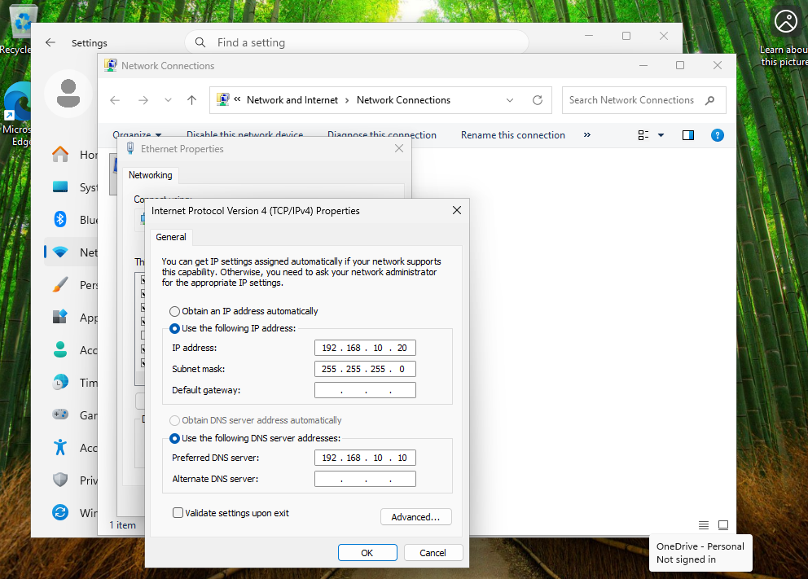
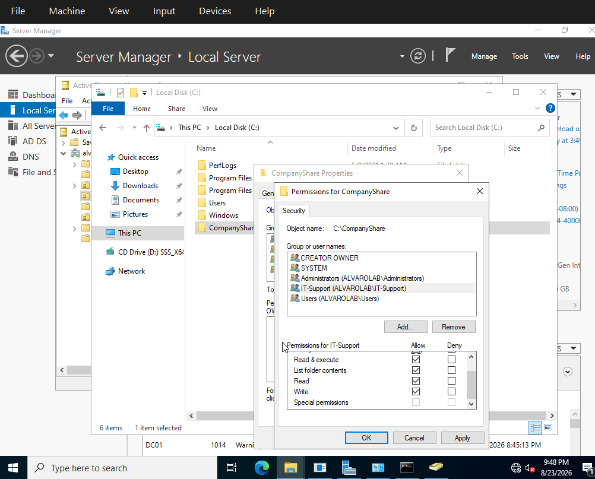
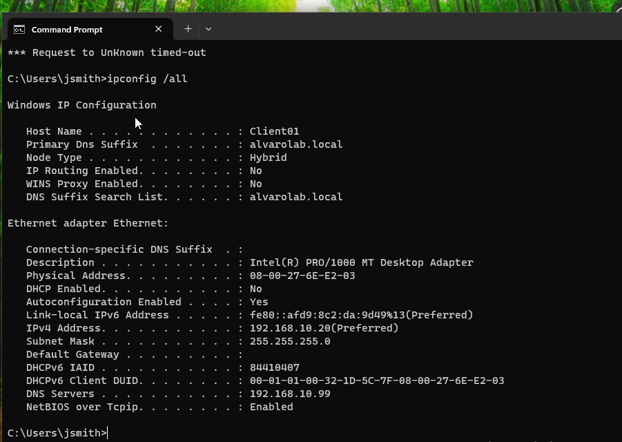
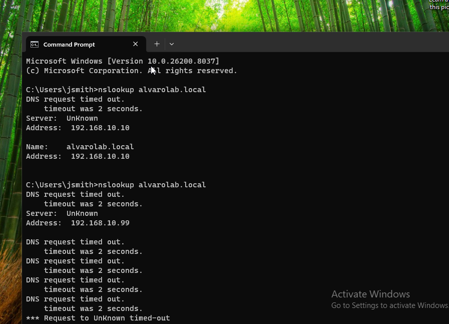
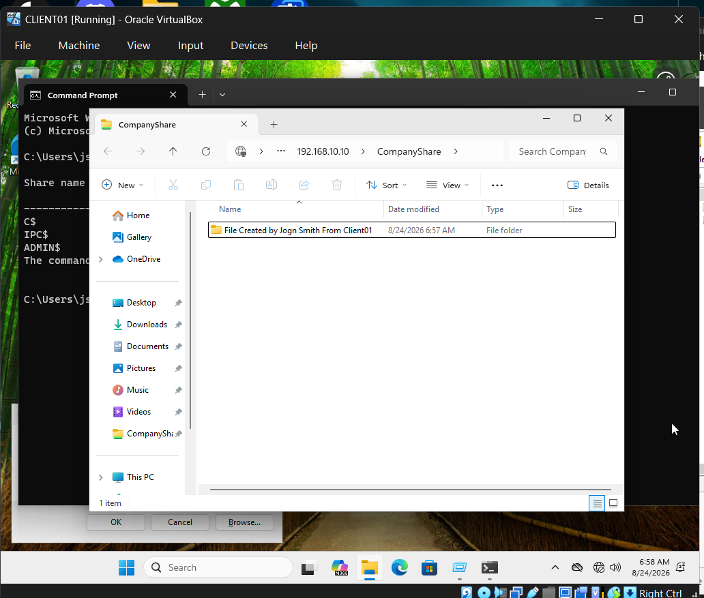
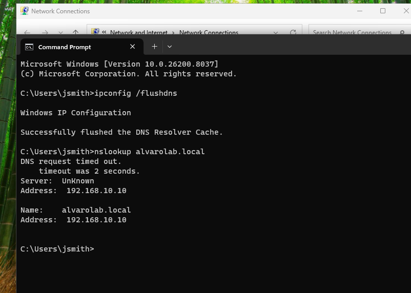

# Active Directory Help Desk Lab

Hands-on Windows Active Directory and IT support lab built to simulate a small business domain environment.

## Lab Overview

In this project, I built a Windows domain environment using Windows Server 2022 and Windows 11 virtual machines in Oracle VirtualBox.

The lab demonstrates practical IT support and system administration skills, including:

- Active Directory Domain Services (AD DS)
- DNS configuration
- Static IP configuration
- Organizational Units (OUs)
- User and group management
- Domain joining
- Group-based permissions
- Network file sharing
- DNS and network troubleshooting

## Lab Environment

- Oracle VirtualBox
- Windows Server 2022
- Windows 11
- Active Directory Domain Services
- DNS
- Domain: `alvarolab.local`
- Domain Controller: `DC01`
- Client Machine: `CLIENT01`
- Server IP: `192.168.10.10`
- Client IP: `192.168.10.20`

## What I Built

I configured a Windows Server 2022 domain controller and created the `alvarolab.local` Active Directory domain. I then configured a Windows 11 client, connected it to the domain, and used the environment to practice common help desk and system administration tasks.

The lab included creating organizational units, users, and security groups, assigning users to groups, configuring shared-folder permissions, testing access from a domain-joined workstation, and troubleshooting DNS and network configuration issues.

---

# Lab Walkthrough

## 1. Active Directory Server Configuration

I configured Windows Server 2022 as the domain controller for the lab and installed Active Directory Domain Services (AD DS) and DNS.

The server provides centralized authentication, user management, group management, and DNS services for the `alvarolab.local` domain.

---

## 2. Active Directory User Creation

Using Active Directory Users and Computers, I created an `Employees` organizational unit and created a test user named John Smith.

The account was used to test domain authentication, security-group membership, file permissions, and access from the Windows 11 client.

---

## 3. Security Group Management

I created and configured an `IT-Support` security group and added John Smith as a member.

Using security groups allows access permissions to be managed by group membership rather than assigning permissions separately to every user.

---

## 4. Windows 11 Client Network Configuration

I configured CLIENT01 with a static IPv4 address and configured the domain controller as its DNS server.

CLIENT01 network configuration:

- IP Address: `192.168.10.20`
- Subnet Mask: `255.255.255.0`
- DNS Server: `192.168.10.10`

Pointing the client to DC01 for DNS allows the workstation to locate Active Directory domain services.

---

## 5. Joining CLIENT01 to the Domain

After configuring the network settings, I joined CLIENT01 to the `alvarolab.local` domain.

The successful domain join demonstrated communication between the Windows 11 workstation and the domain controller.

---

## 6. Domain User Authentication

After joining CLIENT01 to the domain, I logged into the workstation using the John Smith domain account.

I used:

`whoami`

to verify the authenticated account.

The system returned:

`alvarolab\jsmith`

This confirmed that the user successfully authenticated through Active Directory.

---

## 7. CompanyShare NTFS Permissions

On DC01, I created a shared folder named `CompanyShare`.

I configured NTFS permissions for the `IT-Support` Active Directory security group, allowing members of the group to read, execute, list, and write to the folder.

This demonstrated group-based access control using Active Directory.

---

## 8. Client Network Diagnostics

I used Windows command-line tools on CLIENT01 to inspect the workstation's network configuration and troubleshoot communication with the server.

Tools used during the lab included:

- `ipconfig`
- `ipconfig /all`
- `ping`
- `nslookup`
- `ipconfig /flushdns`

These commands helped verify IP configuration, DNS settings, connectivity, and name resolution.

---

# Troubleshooting Exercise

## 9. Diagnosing a DNS Configuration Problem

To practice a realistic help desk troubleshooting scenario, I intentionally changed CLIENT01's DNS configuration from the correct domain controller address to an incorrect DNS server.

Correct DNS server:

`192.168.10.10`

Incorrect DNS server:

`192.168.10.99`

After introducing the incorrect configuration, DNS queries began timing out.

I used `nslookup` and network configuration information to identify that CLIENT01 was attempting to use the wrong DNS server.

### Troubleshooting Process

1. Reproduced the DNS/name-resolution problem.
2. Used `nslookup` to test `alvarolab.local`.
3. Observed DNS request timeouts.
4. Checked CLIENT01's network configuration.
5. Identified the incorrect DNS server.
6. Restored DNS to `192.168.10.10`.
7. Flushed the DNS resolver cache.
8. Re-tested DNS resolution.

This exercise followed a basic help desk troubleshooting workflow:

**Identify → Diagnose → Correct → Verify**

---

## 10. Verifying Network Share Access

After configuring the shared folder and permissions, I accessed `CompanyShare` from CLIENT01 while logged in as John Smith.

I successfully created an item inside the shared folder from the client workstation.

This verified that the domain user's membership in the `IT-Support` security group provided the expected access to the network resource.

---

## 11. DNS Cache Flush and Resolution Verification

After restoring the correct DNS configuration, I cleared the Windows DNS resolver cache using:

`ipconfig /flushdns`

I then used:

`nslookup alvarolab.local`

to test domain name resolution again.

The domain resolved to the domain controller at:

`192.168.10.10`

This demonstrated the final verification stage of the troubleshooting process.

---

# Skills Demonstrated

- Windows Server 2022 administration
- Windows 11 administration
- Active Directory Domain Services (AD DS)
- Active Directory Users and Computers
- Organizational Units (OUs)
- User account administration
- Security group management
- Windows domain joining
- Domain authentication
- DNS configuration
- Static IPv4 configuration
- NTFS permissions
- Network file sharing
- Group-based access control
- Windows command-line troubleshooting
- `ipconfig`
- `ipconfig /all`
- `ping`
- `nslookup`
- `ipconfig /flushdns`
- Oracle VirtualBox
- Basic help desk troubleshooting methodology

# What I Learned

This lab gave me hands-on experience building and supporting a small Windows Active Directory environment from the server through the end-user workstation.

I practiced configuring a Windows Server domain controller, managing Active Directory users and security groups, configuring a Windows 11 client, joining a workstation to a domain, managing access to shared resources, and troubleshooting DNS problems.

The troubleshooting exercise reinforced the importance of identifying symptoms, checking configuration, isolating the cause of a problem, applying a targeted fix, and verifying that the issue has been resolved.
